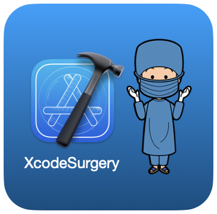
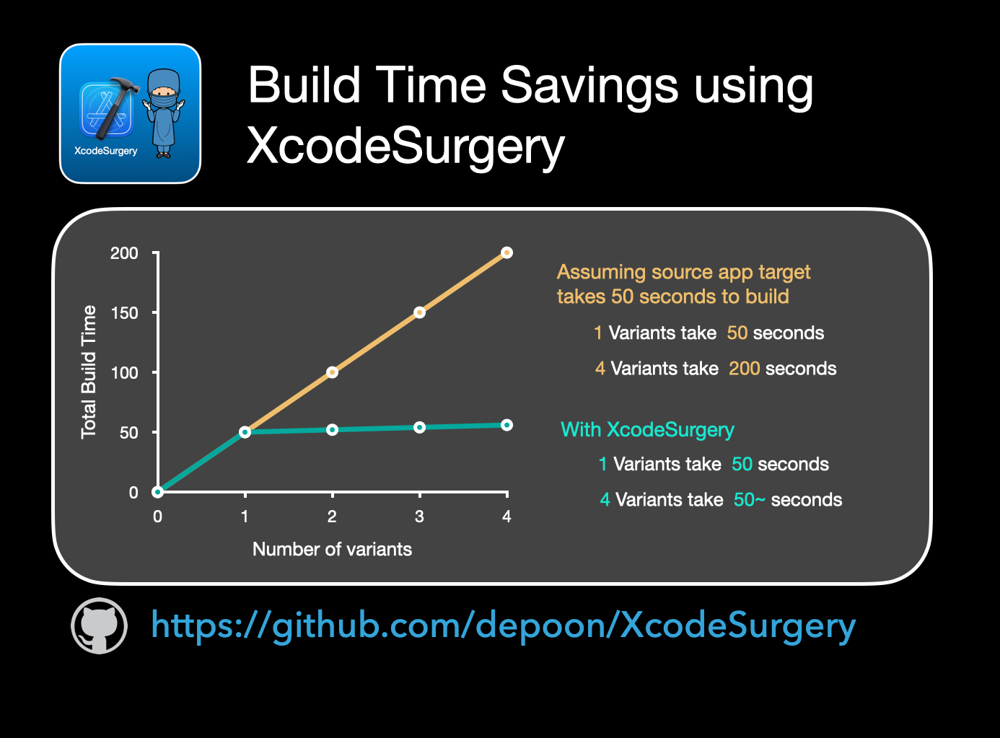

# XcodeSurgery

XcodeSurgery is a swift XCode build phase CLI tool for copying compiled binaries between iOS app targets. 

## The downside with using `xcconfig` or `preprocessor macros` to manage build variants
Building different build variants using configuration will trigger recompilation as the build processes do not share common `$(TARGET_BUILD_DIR)`. Changing preprocessor macro values will trigger dependency graph reanalysis and recompilation of codes. Ideally there should not be recompilation if there's no change in the logic of the source codes.

## Solution: Create a placeholder target and swap binaries.
XcodeSurgery aims to eliminate unnecessary recompilation of source codes when building different flavours or variants of an iOS app target.

## Build Time Savings


## Installing XCodeSurgery


XcodeSurgery is available through Mint 🌱.
```sh
mint install depoon/XcodeSurgery
```

Mint can be installed via Homebrew
```sh
brew install mint
```

## 4 Simple Steps to Setup XcodeSurgery in your Project
1. Create a new app target. We will refer this as the `Destination Target` and the original target as the `Source Target`

2. Copy Build Settings of `Source Target` over to `Destination Target`.


3. Add Preparation Build Phase for `Source Target` using the following command
```sh
xcodesurgery prepare \
--workingDirectory "<WorkingDirectory>" \
--targetBuildDirectory ${TARGET_BUILD_DIR} \
--targetName "${TARGETNAME}"
```
4. Add Transplant Build Phase for `Destination Target` using the following command
```sh
xcodesurgery transplant \
--action ${ACTION} \
--targetBuildDirectory ${TARGET_BUILD_DIR} \
--workingDirectory "<WorkingDirectory>" \
--sourceTarget "<SourceTargetName>" \
--destinationTarget ${TARGETNAME} \
--sdkName ${SDK_NAME}

```

## To build the variants
1. Build the `Source Target`

2. Build the `Destination Target`

## Deploying the app variants
Run the `Destination Target` and observe that you can deploy a clone app of the `Source Target`

You can modify the `Destination Target` build settings with different bundle identifiers, code signing instructions and provisioning profiles to create different build variants.

## xcodesurgery Command Arguments
### Prepare
Argument Name | Comments
------------ | -------------
`workingDirectory` | Directory where target source app will be copied to
`targetBuildDirectory` | ${TARGET_BUILD_DIR} environment argument of source target
`targetName` | ${TARGETNAME} environment argument of source target

### Transplant
Argument Name | Comments
------------ | -------------
`action` | ${ACTION} environment argument of destination target
`workingDirectory` | Directory where target source app will be copied to
`targetBuildDirectory` | ${TARGET_BUILD_DIR} environment argument of destination target
`targetName` | ${TARGETNAME} environment argument of destination target
`sourceTarget` | Name of the source target
`destinationTarget` | ${TARGETNAME} environment argument of destination target
`sdkName` | ${SDK_NAME} environment argument of destination target
`debugInformationFormat` | ${DEBUG_INFORMATION_FORMAT} environment argument of destination target
`filesToRemove` | list of files in sourceTarget app to remove
`filesToInject` | list of files to copy into destinationTarget app

### Frequently Asked Questions
1. [Does XcodeSurgery has dSYM support?](https://github.com/depoon/XcodeSurgery/tree/master/docs/faq#frequently-asked-questions)
2. [I am getting errors because my app does not use Scene Delegate](https://github.com/depoon/XcodeSurgery/tree/master/docs/faq#i-am-getting-errors-because-my-app-does-not-use-scene-delegate)
3. [We are still compiling source codes for each variant](https://github.com/depoon/XcodeSurgery/tree/master/docs/faq#we-are-still-compiling-source-codes-for-each-variant)
4. [The app variant is not picking up the correct icon](https://github.com/depoon/XcodeSurgery/tree/master/docs/faq#the-app-variant-is-not-picking-up-the-correct-icon)
5. [Why use XcodeSurgery when you can simply re-sign the app?](https://github.com/depoon/XcodeSurgery/tree/readme-v4/docs/faq#why-use-xcodesurgery-when-you-can-simply-re-sign-the-app)

