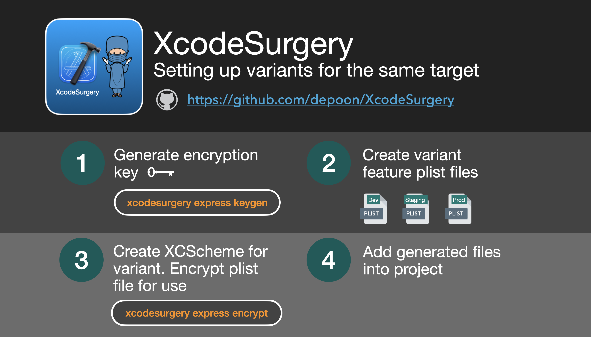
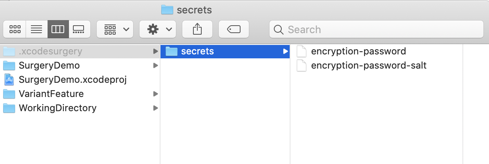

# XcodeSurgery

XcodeSurgery is a swift XCode build phase CLI tool for copying compiled binaries between iOS app targets. 

## The downside with using `xcconfig` or `preprocessor macros` to manage build variants
Building different build variants using configuration will trigger recompilation as the build processes do not share common `$(TARGET_BUILD_DIR)`. Changing preprocessor macro values will trigger dependency graph reanalysis and recompilation of codes. Ideally there should not be recompilation if there's no change in the logic of the source codes.

## Installing XCodeSurgery

XcodeSurgery is available through Mint 🌱.
```sh
mint install depoon/XcodeSurgery
```

Mint can be installed via Homebrew
```sh
brew install mint
```

## Using XcodeSurgery Express

#### Add XcodeSurgery Package to your project. 


Select `VariantEncryption` and `XcodeSurgeryKit` products and add them to your application target.


### Building Variants using same target


#### 1. Create variant feature plist files. 
Don't worry, we will encrypt the files before using them in our application.

#### 2. Generate encryption key
```sh
xcodesurgery express keygen
```
This will create a hidden `.xcodesurgery/secret` folder in the root project folder and generate random password and salt file for use in the encrypt/decrypt process.


#### 3. Create separate XCSchemes for building and running each variant.

#### 4. Add the generated files into your project.


## Solution: Create a placeholder target and swap binaries.
XcodeSurgery aims to eliminate unnecessary recompilation of source codes when building different flavours or variants of an iOS app target.

## Build Time Savings


## 4 Simple Steps to Setup XcodeSurgery in your Project
1. Create a new app target. We will refer this as the `Destination Target` and the original target as the `Source Target`


Do note that you do not need to clone the `Source Target`

2. Copy Build Settings of `Source Target` over to `Destination Target`.


3. Add Preparation Build Phase for `Source Target` using the following command
```sh
xcodesurgery prepare \
--workingDirectory "<WorkingDirectory>" \
--targetBuildDirectory ${TARGET_BUILD_DIR} \
--targetName "${TARGETNAME}"
```
4. Add Transplant Build Phase for `Destination Target` using the following command
```sh
xcodesurgery transplant \
--action ${ACTION} \
--targetBuildDirectory ${TARGET_BUILD_DIR} \
--workingDirectory "<WorkingDirectory>" \
--sourceTarget "<SourceTargetName>" \
--destinationTarget ${TARGETNAME} \
--sdkName ${SDK_NAME}

```

## To build the variants
1. Build the `Source Target`

2. Build the `Destination Target`

## Deploying the app variants
Run the `Destination Target` and observe that you can deploy a clone app of the `Source Target`

You can modify the `Destination Target` build settings with different bundle identifiers, code signing instructions and provisioning profiles to create different build variants.

## xcodesurgery Command Arguments
### Prepare
Argument Name | Comments
------------ | -------------
`workingDirectory` | Directory where target source app will be copied to
`targetBuildDirectory` | ${TARGET_BUILD_DIR} environment argument of source target
`targetName` | ${TARGETNAME} environment argument of source target

### Transplant
Argument Name | Comments
------------ | -------------
`action` | ${ACTION} environment argument of destination target
`workingDirectory` | Directory where target source app will be copied to
`targetBuildDirectory` | ${TARGET_BUILD_DIR} environment argument of destination target
`targetName` | ${TARGETNAME} environment argument of destination target
`sourceTarget` | Name of the source target
`destinationTarget` | ${TARGETNAME} environment argument of destination target
`sdkName` | ${SDK_NAME} environment argument of destination target
`debugInformationFormat` | ${DEBUG_INFORMATION_FORMAT} environment argument of destination target
`filesToRemove` | list of files in sourceTarget app to remove
`filesToInject` | list of files to copy into destinationTarget app

## Frequently Asked Questions
1. [Does XcodeSurgery has dSYM support?](./docs/faq.md#does-xcodesurgery-has-dsym-support)
2. [I am getting errors because my app does not use Scene Delegate](./docs/faq.md#i-am-getting-errors-because-my-app-does-not-use-scene-delegate)
3. [We are still compiling source codes for each variant](./docs/faq.md#we-are-still-compiling-source-codes-for-each-variant)
4. [The app variant is not picking up the correct icon](./docs/faq.md#the-app-variant-is-not-picking-up-the-correct-icon)
5. [Why use XcodeSurgery when you can simply re-sign the app?](./docs/faq.md#why-use-xcodesurgery-when-you-can-simply-re-sign-the-app)

## How to prepare your projects for XcodeSurgery
If you are currently using user-defined-settings or preprocessor macros in your project, you may not be able to take advantage of time savings with having just one compile process.

Here's a quick adjustment you can make to prepare your project for XcodeSurgery

#### 1. Adding custom entry in your app target's Info.plist

Create a new string-value entry in your target's Info.plist file to indiciate which variant you are building.

#### 2. Read custom entry from Info.plist
Read the custom entry from Info.plist and use the corresponding value to create your variant values for your app.
```swift
let env = Bundle.main.infoDictionary?["MY_ENVIRONMENT"] as! String
```

Do take note that this is trade off between having extra code in your application and improvments on build time. If you encounter any issues or difficulties to integrate XcodeSurgery into your project, do help to raise an issue.

## Coming Soon
Support for Extensions. Help raise an issue for one. I welcome contributions to help grow the capabilities of this repository.
